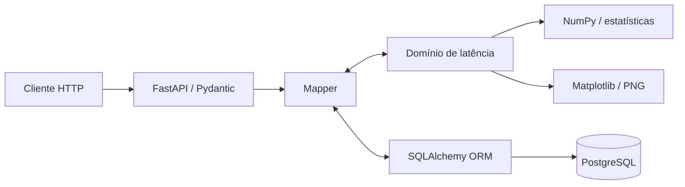

# API Performance Monitor


Backend para armazenar e analisar conjuntos de medições de latência. A API HTTP
atual gerencia datasets e suas medições; o domínio isolado já implementa os
cálculos estatísticos e as visualizações usados na evolução do projeto.

> **Status:** em desenvolvimento. A versão atual trabalha com datasets de
> latência informados pelo usuário; a coleta automática de APIs externas ainda
> não faz parte desta entrega.

## Funcionalidades atuais

- API HTTP para:
  - criar, consultar, listar e excluir datasets;
  - adicionar e remover medições preservando sua ordem;
  - consultar a existência e a quantidade de ocorrências de uma latência;
  - documentar e testar as operações pelo Swagger UI;
- domínio Python para:
  - validar valores negativos, booleanos, `NaN` e infinitos;
  - calcular média, mediana, moda, variância e percentis;
  - identificar outliers pelo intervalo interquartil;
  - gerar histogramas, boxplots e outros gráficos em PNG;
- infraestrutura com:
  - persistência normalizada em PostgreSQL;
  - migrações versionadas pelo Alembic;
  - ambiente reproduzível com uv e Docker Compose.

## Arquitetura



As regras matemáticas permanecem no domínio e não dependem do FastAPI nem do
SQLAlchemy. O mapper faz a conversão explícita entre schemas HTTP, objetos de
domínio e modelos persistidos.

## Tecnologias

| Área | Tecnologia |
| --- | --- |
| API e contratos | FastAPI e Pydantic |
| Domínio e cálculos | Python, NumPy e biblioteca `statistics` |
| Persistência | SQLAlchemy e PostgreSQL 17 |
| Migrações | Alembic |
| Visualização | Matplotlib |
| Ambiente | uv e Docker Compose |

## Executar com Docker

Pré-requisitos: Docker com Compose instalado e o motor do Docker iniciado.

```bash
cp .env.example .env
docker compose build api
docker compose up -d db
docker compose run --rm api uv run --locked --no-sync alembic upgrade head
docker compose up -d api
```

Depois da inicialização:

- Swagger UI: <http://localhost:8000/docs>
- ReDoc: <http://localhost:8000/redoc>
- OpenAPI: <http://localhost:8000/openapi.json>

Para conferir o funcionamento, crie um dataset no Swagger com:

```json
{
  "latency_ms": [100, 120, 150]
}
```

As operações de adicionar e remover devolvem o dataset atualizado na própria
resposta, evitando uma consulta adicional durante os testes.

## Endpoints atuais

| Método | Caminho | Finalidade |
| --- | --- | --- |
| `POST` | `/Datasets/datasets/create` | Criar um dataset. |
| `GET` | `/Datasets/datasets/list` | Listar todos os datasets. |
| `GET` | `/Datasets/datasets/details/{dataset_id}` | Consultar um dataset. |
| `DELETE` | `/Datasets/datasets/delete/{dataset_id}` | Excluir um dataset e suas medições. |
| `POST` | `/Datasets/measurements/add/{dataset_id}` | Adicionar uma medição. |
| `DELETE` | `/Datasets/measurements/remove/{dataset_id}` | Remover a primeira ocorrência de uma medição. |
| `GET` | `/Datasets/measurements/contains/{dataset_id}` | Verificar se uma medição existe. |
| `GET` | `/Datasets/measurements/occurrences/{dataset_id}` | Contar ocorrências de uma medição. |

## Documentação de desenvolvimento

- [Guia do domínio e das visualizações](docs/domain-guide.md)
- [Banco de dados e migrações](docs/database-and-migrations.md)
- [Índice da documentação](docs/README.md)

## Estrutura do projeto

```text
.
├── alembic/                         # Migrações do banco
├── docs/                            # Guias de estudo e desenvolvimento
├── src/api_performance_monitor/
│   ├── domain/                      # Regras e cálculos de latência
│   ├── errors/                      # Tradução de erros para HTTP
│   ├── mapper/                      # Conversões entre camadas
│   ├── models/                      # Modelos SQLAlchemy
│   ├── roots/                       # Rotas FastAPI
│   ├── schemas/                     # Contratos Pydantic
│   └── visualization/               # Gráficos e exportação PNG
├── compose.yaml
├── Dockerfile
└── main.py                          # Configuração da aplicação
```

## Comandos úteis

```bash
docker compose logs -f api
docker compose exec api uv run --locked --no-sync alembic current
docker compose down
```

`docker compose down` remove os containers, mas preserva os dados armazenados
no volume `postgres_data`.
