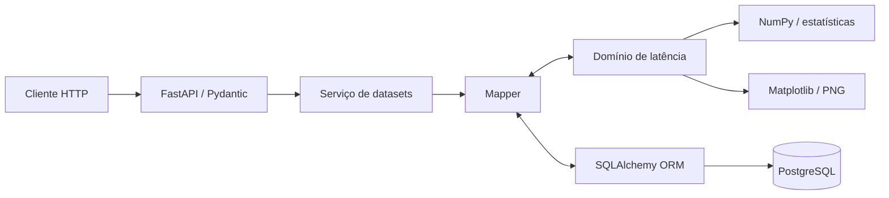

# API Performance Monitor


Backend para armazenar e analisar conjuntos de medições de latência. A API HTTP
gerencia datasets e suas medições e expõe consultas estatísticas; o domínio
isolado concentra os cálculos e as visualizações usados pelo projeto.

> **Status:** em desenvolvimento. A versão atual trabalha com datasets de
> latência informados pelo usuário; a coleta automática de APIs externas ainda
> não faz parte desta entrega.

## Funcionalidades atuais

- API HTTP para:
  - criar, consultar, listar e excluir datasets;
  - adicionar e remover medições preservando sua ordem;
  - consultar a existência e a quantidade de ocorrências de uma latência;
  - calcular tendência central, dispersão, percentis, limites e outliers;
  - documentar e testar as operações pelo Swagger UI;
- domínio Python para:
  - validar valores negativos, booleanos, `NaN` e infinitos;
  - calcular média, mediana, moda, variância e percentis;
  - identificar outliers pelo intervalo interquartil;
  - gerar histogramas, boxplots e outros gráficos em PNG;
- infraestrutura com:
  - persistência normalizada em PostgreSQL;
  - migrações versionadas pelo Alembic;
  - ambiente reproduzível com uv e Docker Compose.

## Arquitetura


```mermaid
flowchart LR
    Client[Cliente HTTP] --> API[FastAPI / Pydantic]
    API --> Service[Serviço de datasets]
    Service --> Mapper[Mapper]
    Mapper <--> Domain[Domínio de latência]
    Mapper <--> ORM[SQLAlchemy ORM]
    ORM --> DB[(PostgreSQL)]
    Domain --> Stats[NumPy / estatísticas]
    Domain --> Charts[Matplotlib / PNG]
```

As regras matemáticas permanecem no domínio e não dependem do FastAPI nem do
SQLAlchemy. O serviço coordena as operações das rotas, enquanto o mapper faz a
conversão explícita entre schemas HTTP, objetos de domínio e modelos
persistidos.

## Tecnologias

| Área | Tecnologia |
| --- | --- |
| API e contratos | FastAPI e Pydantic |
| Domínio e cálculos | Python e NumPy |
| Persistência | SQLAlchemy e PostgreSQL 17 |
| Migrações | Alembic |
| Visualização | Matplotlib |
| Ambiente | uv e Docker Compose |

## Executar com Docker

Pré-requisitos: Docker com Compose instalado e o motor do Docker iniciado.

```bash
cp .env.example .env
docker compose build api
docker compose up -d db
docker compose run --rm api uv run --locked --no-sync alembic upgrade head
docker compose up -d api
```

Depois da inicialização:

- Swagger UI: <http://localhost:8000/docs>
- ReDoc: <http://localhost:8000/redoc>
- OpenAPI: <http://localhost:8000/openapi.json>

Para conferir o funcionamento, crie um dataset no Swagger com:

```json
{
  "latency_ms": [100, 120, 150]
}
```

`POST /datasets` devolve `201 Created`, o dataset criado e o cabeçalho
`Location` para consultá-lo. Para adicionar uma medição, envie
`{"latency_ms": 130}` a `POST /datasets/{dataset_id}/measurements`; a resposta
também devolve `201 Created`, a medição com seu `id` e o respectivo `Location`.
Liste as medições para descobrir seus IDs. A consulta opcional
`?latency_ms=100` devolve apenas as ocorrências desse valor; uma lista vazia
indica ausência e seu tamanho informa a quantidade de ocorrências. Exclua
uma medição pelo seu ID. Ambas as exclusões devolvem `204 No Content`.
O campo `position` preserva a ordem de inserção e pode apresentar lacunas
após exclusões.

## Endpoints atuais

| Método | Caminho | Finalidade |
| --- | --- | --- |
| `POST` | `/datasets` | Criar um dataset. |
| `GET` | `/datasets` | Listar todos os datasets. |
| `GET` | `/datasets/{dataset_id}` | Consultar um dataset. |
| `DELETE` | `/datasets/{dataset_id}` | Excluir um dataset e suas medições. |
| `POST` | `/datasets/{dataset_id}/measurements` | Adicionar uma medição. |
| `GET` | `/datasets/{dataset_id}/measurements` | Listar medições, opcionalmente filtradas por `latency_ms`. |
| `GET` | `/datasets/{dataset_id}/measurements/{measurement_id}` | Consultar uma medição. |
| `DELETE` | `/datasets/{dataset_id}/measurements/{measurement_id}` | Remover a medição identificada pelo ID. |

### Estatísticas

| Método | Caminho | Finalidade |
| --- | --- | --- |
| `GET` | `/datasets/{dataset_id}/statistics/count` | Consultar a quantidade de medições. |
| `GET` | `/datasets/{dataset_id}/statistics/total` | Consultar a soma das latências. |
| `GET` | `/datasets/{dataset_id}/statistics/minimum` | Consultar a menor latência. |
| `GET` | `/datasets/{dataset_id}/statistics/maximum` | Consultar a maior latência. |
| `GET` | `/datasets/{dataset_id}/statistics/amplitude` | Consultar a diferença entre o maior e o menor valor. |
| `GET` | `/datasets/{dataset_id}/statistics/mean` | Consultar a média aritmética. |
| `GET` | `/datasets/{dataset_id}/statistics/median` | Consultar a mediana. |
| `GET` | `/datasets/{dataset_id}/statistics/mode` | Consultar as modas do dataset. |
| `GET` | `/datasets/{dataset_id}/statistics/variance` | Consultar a variância populacional ou amostral. |
| `GET` | `/datasets/{dataset_id}/statistics/standard-deviation` | Consultar o desvio padrão populacional ou amostral. |
| `GET` | `/datasets/{dataset_id}/statistics/first-quartile` | Consultar o primeiro quartil. |
| `GET` | `/datasets/{dataset_id}/statistics/second-quartile` | Consultar o segundo quartil. |
| `GET` | `/datasets/{dataset_id}/statistics/third-quartile` | Consultar o terceiro quartil. |
| `GET` | `/datasets/{dataset_id}/statistics/interquartile-range` | Consultar o intervalo interquartil. |
| `GET` | `/datasets/{dataset_id}/statistics/percentile` | Consultar um percentil. |
| `GET` | `/datasets/{dataset_id}/statistics/outliers` | Consultar possíveis valores atípicos. |
| `GET` | `/datasets/{dataset_id}/statistics/count-above` | Contar medições acima de um limite. |
| `GET` | `/datasets/{dataset_id}/statistics/proportion-above` | Consultar a proporção acima de um limite. |
| `GET` | `/datasets/{dataset_id}/statistics/count-at-or-below` | Contar medições menores ou iguais a um limite. |

As rotas de variância e desvio padrão aceitam o parâmetro de consulta
`sample`, com valor padrão `false`. A rota de percentil usa `percent=95` por
padrão, e as consultas por limite usam `threshold_ms=120`.

## Contrato de erros

Os erros conhecidos da API usam o mesmo formato de resposta:

```json
{
  "detail": "Descrição do erro."
}
```

- `404 Not Found`: o dataset ou a medição solicitada não existe;
- `409 Conflict`: a operação deixaria o dataset sem medições;
- `422 Unprocessable Content`: os dados de entrada ou uma regra de negócio são
  inválidos.

O schema dessa resposta também aparece no OpenAPI e pode ser consultado pelo
Swagger UI.

## Documentação de desenvolvimento

- [Plano detalhado da primeira versão](docs/plano-v1.md)
- [Guia do domínio e das visualizações](docs/domain-guide.md)
- [Banco de dados e migrações](docs/database-and-migrations.md)
- [Índice da documentação](docs/README.md)

## Estrutura do projeto

```text
.
├── alembic/                         # Migrações do banco
├── docs/                            # Guias de estudo e desenvolvimento
├── src/api_performance_monitor/
│   ├── domain/                      # Regras e cálculos de latência
│   ├── errors/                      # Tradução de erros para HTTP
│   ├── mapper/                      # Conversões entre camadas
│   ├── models/                      # Modelos SQLAlchemy
│   ├── roots/                       # Rotas FastAPI
│   ├── schemas/                     # Contratos Pydantic
│   ├── services/                    # Orquestração entre API e persistência
│   └── visualization/               # Gráficos e exportação PNG
├── compose.yaml
├── Dockerfile
└── main.py                          # Configuração da aplicação
```

## Comandos úteis

```bash
docker compose logs -f api
docker compose exec api uv run --locked --no-sync alembic current
uv run --locked pytest -q
docker compose down
```

`docker compose down` remove os containers, mas preserva os dados armazenados
no volume `postgres_data`.
