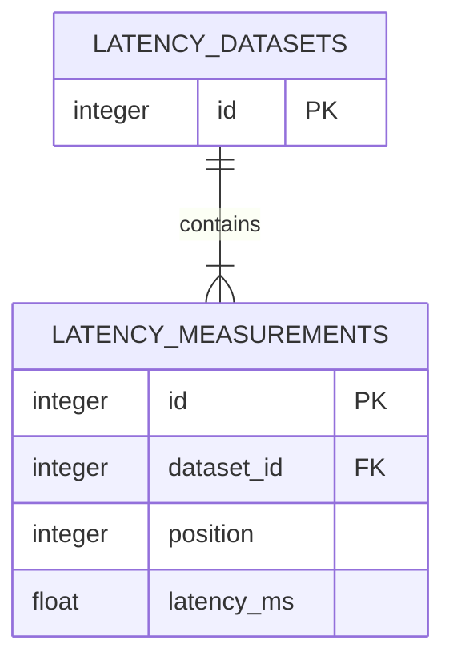

# Banco de dados e migrações

[Voltar ao índice da documentação](README.md)

Este guia registra o fluxo de desenvolvimento do PostgreSQL e do Alembic. Para
uma primeira execução rápida da API, consulte o [README principal](../README.md).

## Modelo persistido

A revisão inicial `0001_create_latency_tables` cria duas tabelas normalizadas:



Cada medição pertence a um dataset e possui uma posição positiva. O banco
rejeita latências negativas e posições repetidas dentro do mesmo dataset. A
relação ORM usa exclusão em cascata para remover as medições junto do dataset.

## Variáveis de ambiente

Copie o arquivo de exemplo antes de iniciar os containers:

```bash
cp .env.example .env
```

A classe `Settings`, em `config.py`, lê as variáveis `POSTGRES_*` e monta a URL
do SQLAlchemy. Entre containers, a API acessa o banco pelo hostname `db`. Para
comandos executados diretamente no host, use `localhost`.

O `.env` é local, não entra no Git e não é copiado para a imagem Docker.

## Inicialização com Docker

```bash
docker compose build api
docker compose up -d db
docker compose run --rm api uv run --locked --no-sync alembic upgrade head
docker compose up -d api
```

O Compose aguarda o healthcheck do PostgreSQL antes de iniciar a API. As
migrações são aplicadas explicitamente: iniciar a aplicação não cria nem altera
tabelas automaticamente.

## Inspecionar o estado das migrações

Dentro do container:

```bash
docker compose exec api uv run --locked --no-sync alembic current
docker compose exec api uv run --locked --no-sync alembic history
```

No ambiente local, com o PostgreSQL do Compose ativo:

```bash
uv sync --locked
POSTGRES_HOST=localhost uv run --locked alembic current
POSTGRES_HOST=localhost uv run --locked alembic history
```

## Criar uma futura migração

Depois de alterar os modelos SQLAlchemy:

```bash
POSTGRES_HOST=localhost uv run --locked alembic revision --autogenerate -m "descricao_da_alteracao"
POSTGRES_HOST=localhost uv run --locked alembic upgrade head
```

Revise o arquivo gerado antes de aplicar a migração. Depois de alterar o código
ou adicionar revisões, reconstrua a imagem da API:

```bash
docker compose up -d --build api
```

## Volume e ciclo de vida

```bash
docker compose logs -f api
docker compose down
```

`docker compose down` remove os containers, mas preserva o volume
`postgres_data`. As variáveis `POSTGRES_*` inicializam o PostgreSQL apenas
quando esse volume está vazio.

O arquivo SQLite legado não é importado nem alterado pelo fluxo atual. No WSL,
habilite a integração da distribuição no Docker Desktop; quando necessário,
use `docker.exe` no lugar de `docker`.

## Upgrade e downgrade da revisão inicial

`upgrade()` cria `latency_datasets`, `latency_measurements`, índices e
restrições. `downgrade()` remove as duas tabelas e seus dados. Um downgrade é
destrutivo e deve ser usado somente quando a perda desses dados for aceitável.
