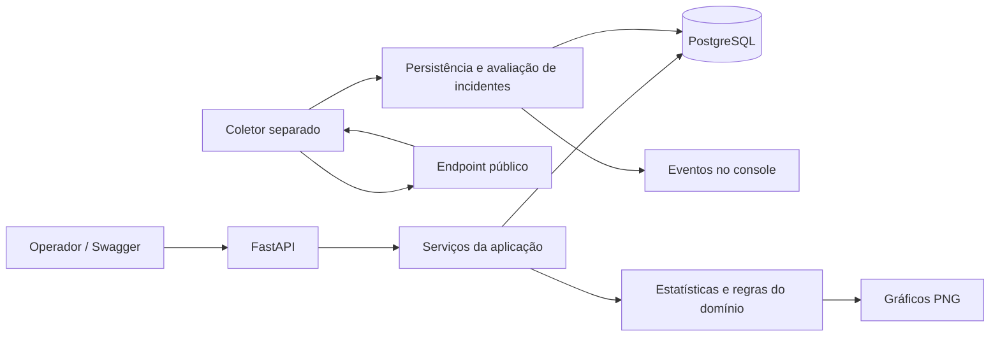
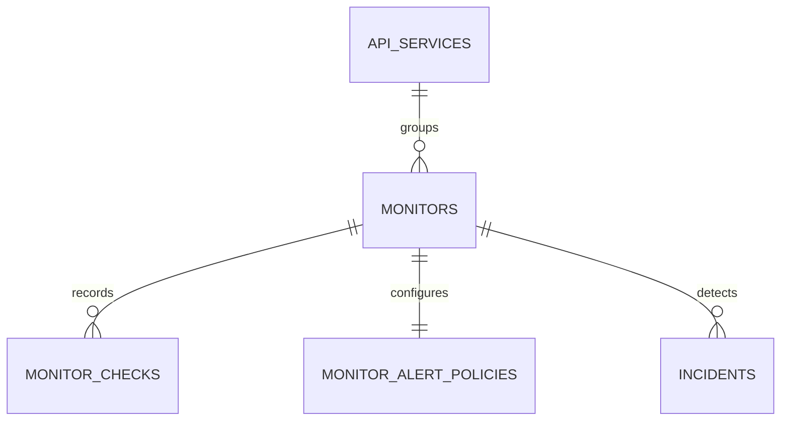

# Plano do projeto — API Performance Monitor v1

[Voltar ao índice da documentação](README.md)

**Estado:** planejamento; as funcionalidades futuras descritas aqui ainda precisam
ser implementadas. **Data da revisão do código:** 30/09/2026.

**Público:** pessoa júnior ou estagiária com conhecimentos iniciais de Python,
FastAPI, SQL e testes. O objetivo é entregar uma primeira versão utilizável,
avançando por tarefas pequenas e verificáveis.

Navegação: [escopo](#2-ponto-de-partida-e-limites-do-projeto) ·
[arquitetura](#3-vocabulário-e-arquitetura) ·
[banco](#4-modelo-de-dados-proposto) ·
[rotas](#7-contratos-http-propostos) ·
[etapas](#9-etapas-de-implementação) ·
[aceitação](#matriz-mínima-de-aceitação-da-v1) ·
[continuidade](#12-continuidade-entre-sessões-e-evoluções-futuras).

## 1. O que significa terminar a primeira versão

Ao terminar este plano, uma pessoa deverá conseguir:

1. Subir PostgreSQL, API e coletor com Docker Compose.
2. Cadastrar um serviço e um endpoint HTTP público para monitorar.
3. Configurar intervalo, timeout, status esperado e limites de alerta.
4. Receber verificações automáticas, mesmo sem acessar o Swagger.
5. Consultar histórico, falhas, latência e situação da coleta.
6. Ver incidentes abrirem e se resolverem conforme regras simples.
7. Comparar dois períodos e exportar dados e gráficos.
8. Pausar e retomar um monitor preservando seu histórico.
9. Reiniciar os containers e continuar trabalhando com os dados anteriores.

**Cenário de demonstração:** cadastrar a API de catálogo, acompanhar seu endpoint
de produtos, observar três respostas com falha, consultar o incidente aberto,
observar duas recuperações e consultar o incidente resolvido. Depois, obter o
resumo das últimas 24 horas e exportar um CSV.

Essa demonstração usará um servidor HTTP controlado nos testes. Uma API pública
real serve como demonstração complementar, pois não controlamos sua estabilidade.

### Como usar este documento

- Leia as seções 1 a 8 para entender as decisões e os contratos.
- Execute as etapas da seção 9 em ordem. Cada etapa tem dependências, tarefas,
  verificação e condição de conclusão.
- Marque uma tarefa somente depois de conferir seu comportamento.
- Use as seções 10 a 12 para organizar o trabalho e registrar a continuidade.
- Os exemplos de rotas, JSON e comandos do coletor são **contratos propostos**;
  só funcionarão depois da etapa correspondente.

## 2. Ponto de partida e limites do projeto

### O que já existe no código

| Parte | Situação observada | Como aproveitar |
| --- | --- | --- |
| Datasets e medições | CRUD, IDs de medições e rotas REST. | Preservar a API atual e seus dados. |
| Estatísticas | Média, mediana, percentis, dispersão, limites e outliers. | Reutilizar os cálculos sobre amostras válidas. |
| Gráficos | Histograma, boxplot, frequência, distribuição e evolução por posição. | Reutilizar funções e criar uma evolução com horários reais. |
| Persistência | SQLAlchemy, PostgreSQL e migração inicial Alembic. | Acrescentar tabelas por novas migrações. |
| Infraestrutura | Docker Compose com API e banco; ambiente com uv. | Acrescentar o serviço do coletor. |
| Testes | Testes de domínio, erros, mapper, gráficos e algumas rotas. | Registrar uma execução inicial e ampliar por funcionalidade. |

A leitura do código não equivale a executar os testes. Este documento não declara
uma quantidade de testes aprovados. A execução de referência pertence à etapa 0.
Havia alterações locais e um arquivo de testes ainda não rastreado no momento do
planejamento; preservá-los e revisar sua origem antes de organizar commits.

### Decisões adotadas para esta versão

O planejamento anterior do projeto registrava monitoramento ativo, PostgreSQL,
GET público, usuário único, alertas simples e histórico integral. Esse é o contexto
histórico usado aqui; este documento explicita a proposta atual para execução.

| Decisão | Regra da v1 |
| --- | --- |
| Uso | Uma pessoa operando localmente ou em ambiente privado. API publicada em `127.0.0.1`, como no Compose atual. |
| Requisições monitoradas | Apenas GET público por HTTP/HTTPS, portas 80/443; sem autenticação no destino. |
| Redirecionamentos | Não seguir automaticamente; registrar o status recebido. |
| Histórico | Guardar todas as verificações; pausar não apaga dados. |
| API existente | Manter `/datasets` e as rotas atuais compatíveis. |
| Banco existente | Preservar a revisão `0001`; criar migrações incrementais. |
| Coletor | Processo separado, com apenas uma instância líder na v1. |
| Alertas | Incidentes persistidos, consultáveis pela API, com eventos em logs na abertura e resolução. |
| Interface | Swagger, respostas JSON, CSV e PNG. |
| Versionamento | Usar versões `0.x` durante as etapas; concluir com proposta de `1.0.0`. |

Este plano preserva as tabelas atuais porque elas já sustentam funcionalidades
utilizáveis. Isso substitui a antiga ideia de começar o banco do zero. Não converter
medições manuais em verificações automáticas: elas não têm horário, URL ou status.

### Fora da primeira versão

- Contas, login, múltiplos clientes e publicação aberta na internet.
- POST/PUT/DELETE nos destinos, tokens, cookies ou cabeçalhos personalizados.
- Frontend próprio, aplicativo móvel e atualização por WebSocket.
- E-mail, Telegram, Slack ou webhooks para entrega de notificações.
- Filas distribuídas, múltiplos coletores, Redis, Celery e Kubernetes.
- CPU, memória, tráfego real de usuários, rastreamento distribuído e banco remoto.
- Teste de carga, detecção por inteligência artificial e previsão de falhas.
- Exclusão automática do histórico e tabelas de agregações permanentes.

Os alertas desta versão ficam na API e no console do operador. Entrega externa
confiável, com tentativas e controle de duplicação, será uma evolução específica.

## 3. Vocabulário e arquitetura

| Termo | Significado no projeto |
| --- | --- |
| Serviço | Agrupamento, como “API de catálogo”. |
| Monitor | Configuração de uma URL que será verificada periodicamente. |
| Check ou verificação | Resultado de uma tentativa de consultar essa URL. |
| Worker ou coletor | Processo que agenda e executa as verificações. |
| Política de alerta | Regras que determinam quando abrir e resolver incidentes. |
| Incidente | Registro de um problema detectado e de sua recuperação observada. |
| Heartbeat | Horário atualizado pelo coletor para indicar que continua executando. |
| Migração | Alteração versionada da estrutura do banco. |
| Idempotência | Repetir uma operação sem criar um segundo resultado indevido. |
| p95 | Percentil que descreve a cauda das latências; depende das amostras e do método de cálculo. |



### Responsabilidade de cada camada

- **Rotas:** recebem HTTP, validam o contrato e retornam status/cabeçalhos.
- **Schemas:** descrevem entradas e saídas; deixam unidades e campos explícitos.
- **Serviços:** coordenam banco, regras e transações.
- **Domínio:** calcula métricas e transições de incidentes sem depender do FastAPI.
- **Modelos:** representam tabelas, relações, índices e restrições.
- **Cliente HTTP:** consulta um destino e devolve um resultado estruturado.
- **Coletor:** decide quando executar, limita concorrência e acompanha seu estado.

Preservar SQLAlchemy síncrono nas rotas. O cliente HTTP do coletor poderá usar
`httpx.AsyncClient` para concorrência limitada e cancelamento. Funções de banco
do coletor executadas em threads devem criar e fechar sua própria sessão dentro
da função; nunca compartilhar uma `Session` entre tarefas ou threads.

O `httpx` já aparece no lockfile, mas deve ser declarado como dependência direta
de execução ao ser usado pelo coletor. Existe também `httpx2` no grupo de
desenvolvimento; não trocar as dependências dos testes incidentalmente.

Não iniciar o agendador no import de `main.py` nem em cada processo do Uvicorn.
`BackgroundTasks` executa trabalho associado à resposta HTTP; o agendamento
contínuo deste projeto terá um processo próprio. Veja a documentação de
[Background Tasks do FastAPI](https://fastapi.tiangolo.com/tutorial/background-tasks/).

### Organização proposta dos arquivos

```text
src/api_performance_monitor/
├── domain/
│   ├── monitoring.py             # resultados e regras de monitoramento
│   ├── incidents.py              # abertura e recuperação
│   └── latency.py                # cálculos existentes
├── models/
│   └── monitoring_models.py      # novas tabelas
├── schemas/
│   ├── monitor_schema.py
│   ├── check_schema.py
│   └── monitor_statistics_schema.py
├── services/
│   ├── monitor_service.py
│   ├── check_service.py
│   ├── incident_service.py
│   └── monitor_statistics_service.py
├── roots/
│   ├── services_root.py
│   ├── monitors_root.py
│   └── health_root.py
├── monitoring/
│   ├── client.py                 # requisição e medição
│   ├── url_policy.py             # destinos permitidos
│   ├── scheduler.py              # seleção dos próximos trabalhos
│   └── worker.py                 # ponto de entrada do processo
└── visualization/
    └── charts.py                 # reutilização e novos gráficos

tests/
├── monitoring/                   # cliente, URL, agenda e retomada
├── services/                     # resumos e incidentes
├── integration/                  # PostgreSQL real e migrações
└── roots/                        # contratos HTTP
```

Os caminhos novos são sugestões concretas para orientar a implementação. Criar
um arquivo quando houver responsabilidade para ele; evitar classes vazias e
abstrações genéricas que ainda não resolvem um problema do projeto.

## 4. Modelo de dados proposto

Usar nomes em inglês, `snake_case`, IDs `BIGINT` gerados pelo banco e horários
com fuso (`TIMESTAMPTZ`), normalizados para UTC. Valores públicos terminados em
`_ms` usam milissegundos; os terminados em `_seconds` usam segundos.



### 4.1 `api_services`

| Campo | Regra |
| --- | --- |
| `id` | Chave primária. |
| `name` | Obrigatório, 1–100 caracteres após remover espaços nas pontas. |
| `description` | Opcional, até 500 caracteres. |
| `created_at`, `updated_at` | Horários de criação e última edição. |

Um serviço agrupa monitores. Não terá exclusão na v1; nomes podem se repetir,
pois o ID é sua identidade. Renomear não altera o histórico de seus monitores.

### 4.2 `monitors`

| Campo | Regra |
| --- | --- |
| `id`, `service_id` | Identidade e FK do serviço. |
| `name` | Obrigatório, até 100 caracteres; único dentro do serviço. |
| `url` | HTTP/HTTPS público validado, até 2.048 caracteres. |
| `expected_status_code` | Um status esperado, de 200 a 599; padrão 200. |
| `interval_seconds` | Entre 60 e 86.400; padrão 60. |
| `timeout_seconds` | Entre 1 e 30, menor que o intervalo; padrão 10. |
| `is_active` | Padrão `false`; ativar depois de revisar a configuração. |
| `next_check_at` | Próximo horário previsto; `null` enquanto pausado. |
| `evaluation_started_at` | Início da sequência válida para avaliação de alertas. |
| `created_at`, `updated_at` | Auditoria básica. |

URL e serviço ficam imutáveis após a criação. Um destino diferente exige outro
monitor, para preservar o significado do histórico. Nome pode mudar a qualquer
momento; intervalo, timeout e status esperado só mudam enquanto pausado.
O status esperado também não pode mudar com incidente aberto; retornar `409`
nesse caso, para não redefinir sucesso no meio de um problema ainda acompanhado.

Não exigir URL única: dois monitores podem observar o mesmo destino com nomes
e configurações diferentes. A v1 simplifica a antiga proposta de faixa de status
para um status esperado exato. Uma falha é relativa a esse contrato.

### 4.3 `monitor_checks`

| Campo | Regra |
| --- | --- |
| `id`, `monitor_id` | Identidade e FK do monitor. |
| `scheduled_at` | Horário previsto que identifica a execução. |
| `started_at`, `finished_at` | Horários efetivos da tentativa. |
| `duration_ms` | Duração medida por relógio monotônico, finita e não negativa. |
| `result_status` | Resultado conforme a tabela abaixo. |
| `http_status_code` | Status recebido; pode ser `null` sem resposta HTTP. |
| `error_code` | Categoria curta e controlada; sem texto bruto de exceções. |
| `expected_status_code` | Cópia da configuração usada nessa execução. |
| `timeout_seconds` | Cópia do timeout usado nessa execução. |

| `result_status` | Significado | Status HTTP |
| --- | --- | --- |
| `success` | Resposta completa, dentro dos limites, com status esperado. | Obrigatório e igual ao esperado. |
| `unexpected_status` | Resposta completa com status diferente do esperado. | Obrigatório e diferente do esperado. |
| `timeout` | Esgotamento do prazo de execução. | Opcional, se os cabeçalhos chegaram antes do timeout. |
| `network_error` | DNS, conexão, certificado TLS ou leitura interrompida. | Opcional, se houve resposta parcial. |
| `blocked_target` | Endereço de destino rejeitado pela política de rede. | `null`. |
| `response_too_large` | Resposta excedeu o limite de leitura. | Obrigatório. |

Uma tentativa falha também tem duração, mas essa duração não entra nos percentis
de sucesso. Não armazenar corpos, cookies, cabeçalhos ou credenciais.

Restrições e índices obrigatórios:

- `UNIQUE (monitor_id, scheduled_at)` para impedir duplicação persistida.
- Índice `(monitor_id, started_at DESC, id DESC)` para histórico e períodos.
- `CHECK` para duração finita/não negativa e combinações válidas de resultado/status.
- `CHECK` de `finished_at >= started_at`; sincronizar o relógio do ambiente e
  tratar anomalias do relógio como erro operacional, sem fabricar uma medição.
- FKs com exclusão restrita. Não oferecer alteração/exclusão individual de checks.

### 4.4 `monitor_alert_policies`

Uma política por monitor, criada na mesma transação do monitor.

| Campo | Regra/padrão |
| --- | --- |
| `monitor_id` | PK e FK do monitor. |
| `is_enabled` | `true`. |
| `latency_threshold_ms` | Finito e maior que zero; padrão 500. |
| `failure_threshold` | Falhas consecutivas para abrir indisponibilidade; padrão 3. |
| `slow_threshold` | Sucessos lentos consecutivos para abrir degradação; padrão 3. |
| `recovery_threshold` | Recuperações consecutivas para resolver; padrão 2. |

Limitar os três contadores configuráveis a 1–20. Só editar a política com o monitor
pausado e sem incidentes abertos; caso contrário, retornar `409`. Isso evita mudar
as condições de resolução de um incidente que já existe.

### 4.5 `incidents`

| Campo | Regra |
| --- | --- |
| `id`, `monitor_id` | Identidade e vínculo com o monitor. |
| `incident_kind` | `availability` ou `performance`. |
| `opened_at`, `resolved_at` | Abertura e recuperação observadas; resolução inicialmente `null`. |
| `opening_check_id`, `resolving_check_id` | Checks que completaram as sequências de abertura e resolução. |

Criar índice único parcial em `(monitor_id, incident_kind)` onde
`resolved_at IS NULL`. Isso impede dois incidentes abertos do mesmo tipo.
Garantir que os checks referenciados pertencem ao mesmo monitor, por FK composta
ou restrição equivalente. Horário de resolução nunca pode preceder abertura.

### 4.6 `worker_state`

Tabela operacional com uma linha para o coletor: `worker_name` como chave,
`instance_id`, `started_at`, `heartbeat_at`, `last_scheduler_cycle_at` e
`last_check_finished_at` opcional. Não é uma tabela de métricas dos destinos.

O heartbeat indica atividade do processo; o ciclo indica que a agenda está
avançando. Nenhum dos dois, isoladamente, prova que uma API monitorada está saudável.

## 5. Regras de coleta, agenda e incidentes

### 5.1 O que a duração mede

A duração começa antes da resolução DNS e termina ao concluir a leitura da
resposta ou interromper a tentativa. Inclui rede, TLS, espera do servidor e
transferência; não representa somente o tempo interno do servidor.

Medir duração com relógio monotônico e registrar datas em UTC. Reutilizar conexões
é permitido; documentar que algumas verificações usarão conexão já estabelecida.
Ler por streaming, descartando o conteúdo, com limite inicial de **1 MiB dos bytes
lidos**. Fixar `Accept-Encoding: identity` e limitar a leitura bruta para manter a
regra simples. Uma resposta maior gera `response_too_large`.

Aplicar um prazo total cancelável de `timeout_seconds`, incluindo DNS e leitura,
além dos limites do cliente HTTP. Os timeouts de leitura do HTTPX são por espera
de um bloco; não equivalem sozinhos a um prazo total. Referências:
[timeouts](https://www.python-httpx.org/advanced/timeouts/) e
[cliente assíncrono](https://www.python-httpx.org/async/).

Não repetir automaticamente uma requisição que falhou. Uma nova tentativa normal
ocorre no próximo intervalo; retries esconderiam falhas e alterariam as métricas.

### 5.2 Destinos permitidos

1. Validar esquema, hostname e porta; rejeitar credenciais embutidas e fragmentos.
2. Para esta v1, rejeitar query strings para evitar armazenar tokens em URLs.
3. Resolver IPv4/IPv6 e rejeitar qualquer destino não público, incluindo loopback,
   redes privadas, link-local e endereços de metadados.
4. Validar novamente em cada execução. A validação do cadastro não basta.
5. Garantir que a conexão usa o IP validado, preservando hostname/TLS. Não fazer
   uma segunda resolução não controlada entre validar e conectar.
6. Desabilitar redirects, proxies herdados do ambiente e persistência de cookies
   entre verificações. Manter validação de certificados TLS.

O adapter do cliente deve encapsular a resolução e conexão ao IP validado. Esse é
um ponto para revisão técnica com alguém mais experiente. A etapa só termina com
teste de DNS alterado entre validação e conexão. Os princípios vêm do guia de
[prevenção de SSRF da OWASP](https://cheatsheetseries.owasp.org/cheatsheets/Server_Side_Request_Forgery_Prevention_Cheat_Sheet.html);
o uso de ambiente pelo cliente é documentado em
[variáveis de ambiente do HTTPX](https://www.python-httpx.org/environment_variables/).

Testes locais usam cliente/resolvedor injetados ou uma permissão restrita ao
servidor de teste no ambiente de testes. Essa exceção não fica exposta na API e
não deve habilitar genericamente endereços privados na configuração normal.

### 5.3 Agenda e reinicialização

- Começar com até **10 monitores ativos**, no máximo **5 requisições concorrentes**
  e um ciclo de seleção a cada 2 segundos. São limites de escopo, não um benchmark.
- Ao ativar, definir `next_check_at` como agora e reiniciar a sequência de avaliação.
- Selecionar monitores ativos vencidos, ordenando por `next_check_at` e ID.
- Não executar duas verificações simultâneas do mesmo monitor.
- Não manter transação ou bloqueio de linha aberto durante acesso à rede.
- Ao terminar, avançar a agenda para o primeiro horário da sequência original
  posterior ao término. Não tentar recuperar todos os intervalos perdidos.
- Persistir check, transição de incidente e próxima agenda em uma transação curta.
- Após uma pausa longa, executar uma nova tentativa por monitor vencido e mostrar
  o atraso; não inventar resultados para horários que ficaram sem coleta.

Usar um advisory lock de sessão do PostgreSQL para eleger o único coletor. Manter
a conexão que segura o lock dedicada e aberta; não devolvê-la ao pool. Uma segunda
instância deve encerrar com mensagem clara. Se perder essa conexão, parar de
agendar, cancelar tentativas pendentes e encerrar. A aplicação precisa controlar
explicitamente esse ciclo, conforme os
[advisory locks do PostgreSQL](https://www.postgresql.org/docs/17/explicit-locking.html#ADVISORY-LOCKS).

Se o processo cair depois de consultar o destino e antes de gravar, a consulta
poderá ser repetida ao reiniciar. A garantia da v1 é **no máximo um check persistido
por monitor/horário previsto**, não exatamente uma chamada HTTP. Conflito de
unicidade não pode disparar uma segunda transição de incidente.

Ao pausar, impedir novas execuções. Uma tentativa já iniciada pode terminar e ser
salva, mas não abre nem resolve incidentes se o monitor já estiver pausado. Usar
bloqueio curto do monitor ao persistir para coordenar essa decisão com o PATCH.
Ao retomar, só checks iniciados na nova janela de avaliação contam para sequências.
Uma tentativa antiga que terminar depois da retomada não avalia incidentes nem
sobrescreve a agenda nova. Preservar seu resultado e reconhecer a mudança de
`evaluation_started_at` ao finalizar, dentro da mesma transação.

### 5.4 Regras de incidentes

Ordenar checks por `started_at` e ID. Calcular sequências a partir dos últimos
checks persistidos; os limites 1–20 permitem consultas pequenas sem manter
contadores apenas na memória. Resetar a sequência após pausa/retomada ou um
intervalo entre inícios maior que `2 × interval_seconds`.

| Tipo | Abertura | Recuperação |
| --- | --- | --- |
| `availability` | N checks consecutivos diferentes de `success`. | R checks consecutivos `success`, mesmo se lentos. |
| `performance` | N checks consecutivos `success` com duração **maior** que o limite. | R checks consecutivos `success` com duração **menor ou igual** ao limite. |

Uma falha interrompe a sequência de lentidão e de recuperação de performance.
Um sucesso dentro do limite interrompe a sequência de lentidão. Os dois tipos
podem coexistir. Pausar, desabilitar a política ou ficar sem dados não representa
recuperação e não fecha incidentes automaticamente.

Exemplo com N=3, R=2 e limite=500 ms:

```text
500, timeout, 500       -> abre availability na terceira falha
200/800ms, 200/900ms    -> resolve availability; acumula duas lentidões
200/700ms              -> abre performance
200/100ms, 200/120ms    -> resolve performance
```

Emitir log de abertura/resolução somente depois do commit. O registro no banco
é a fonte de verdade; queda entre commit e log pode perder o aviso no console.
Entrega garantida de notificações não faz parte desta versão.

## 6. Métricas e interpretação dos dados

### Períodos e ausência de amostras

- Consultas temporais usam `[start, end)`: incluem início e excluem fim.
- Filtrar checks por `started_at`, com data ISO 8601 e fuso obrigatório.
- Nos resumos e exportações, ausência de ambos usa últimas 24 horas, calculando
  `end` uma única vez. Fornecer somente um dos limites resulta em `422`.
- Exigir `start < end` e janela máxima de 31 dias.
- O histórico paginado pode percorrer todo o histórico quando não houver período.
- Monitor inexistente resulta em `404`; monitor existente sem dados resulta em
  `200`, contagens zero e métricas sem amostras como `null`.

### Resumo de um monitor

| Campo | Cálculo/regra |
| --- | --- |
| `total_checks` | Todas as tentativas persistidas no período. |
| `successful_checks` | Checks com resultado `success`. |
| `failed_checks` | Total menos sucessos. |
| `success_rate_pct` | `100 × successful_checks / total_checks`; `null` se total zero. |
| `failure_rate_pct` | `100 × failed_checks / total_checks`; `null` se total zero. |
| `failures_by_type` | Contagens de cada resultado de falha. |
| `mean_ms`, `min_ms`, `max_ms`, `p50_ms`, `p95_ms`, `p99_ms` | Somente durações de `success`. |
| `sample_size` | Quantidade de sucessos usados nas estatísticas. |
| `last_check` | Última tentativa conhecida, mesmo fora do período solicitado. |
| `collection_status` | `paused`, `no_data`, `fresh` ou `stale`, conforme abaixo. |
| `open_incidents` | Incidentes ainda abertos no momento da consulta. |

Prioridade para `collection_status`: pausado → `paused`; ativo sem check na atual
janela de avaliação → `no_data`; coletor sem heartbeat/ciclo recente ou última
verificação iniciada há mais de `2 × intervalo + timeout` → `stale`; demais →
`fresh`. Incluir `monitoring_since` para mostrar há quanto tempo se espera dados.

Não chamar a taxa de sucesso de “uptime exato”. As verificações são amostras;
intervalos sem coleta não são classificados como sucesso nem como falha. Mostrar
também `max_observed_gap_seconds`: maior intervalo entre inícios dentro da janela,
ou `null` com menos de dois checks. Esse campo não é uma medida completa de cobertura.

O tempo de um incidente vai da abertura detectada à resolução detectada; não
afirmar que corresponde à duração exata de uma indisponibilidade real.

Reutilizar `LatencyDataset` apenas quando houver sucessos. Não alterar sua regra
de rejeitar dataset vazio. Com uma amostra, percentis existem, mas têm utilidade
limitada; sempre devolver `sample_size`. Usar o método de percentil existente,
sem arredondar valores intermediários.

Separar sucessos de falhas evita que uma resposta de erro muito rápida reduza a
latência apresentada como saudável. A distinção e os limites de monitoramento
externo são discutidos no
[capítulo de monitoramento do Google SRE](https://sre.google/sre-book/monitoring-distributed-systems/).

### Comparação entre períodos

Receber dois períodos explícitos, sem sobreposição e com a mesma duração, cada
um com no máximo 31 dias. Devolver os dois resumos, tamanhos de amostra e:

- Diferença absoluta de p95: `p95_atual - p95_anterior`.
- Variação de p95 em porcentagem: `100 × diferença / p95_anterior`.
- Diferença de taxa de sucesso em **pontos percentuais**.

Se faltar amostra, devolver `null` na comparação afetada. Se a base do p95 for
zero, devolver variação percentual `null` e manter a diferença absoluta. Usar
descrições “aumentou/diminuiu/igual”, sem afirmar causa ou significância estatística.

### Limites de consulta

Carregar somente os campos necessários. Começar com no máximo 50.000 checks por
consulta analítica/exportação; se exceder, devolver `422` orientando a reduzir o
período, sem truncar silenciosamente. Contagens e seleção devem usar a mesma
visão consistente dos dados. Isso permite histórico integral com custo limitado.

## 7. Contratos HTTP propostos

Não renomear `/datasets` nem introduzir um prefixo novo em rotas existentes.
Criar tags no Swagger: Serviços, Monitores, Verificações, Incidentes e Operação.

| Método e rota | Entrega |
| --- | --- |
| `POST /services` | Criar serviço; `201` e `Location`. |
| `GET /services` | Listar serviços com paginação. |
| `GET /services/{service_id}` | Consultar serviço. |
| `PATCH /services/{service_id}` | Editar nome/descrição; `200`. |
| `POST /services/{service_id}/monitors` | Criar monitor e política; `201` e `Location`. |
| `GET /services/{service_id}/monitors` | Listar monitores do serviço. |
| `GET /monitors/{monitor_id}` | Consultar configuração. |
| `PATCH /monitors/{monitor_id}` | Renomear, pausar, retomar ou editar campos permitidos; `200`. |
| `GET /monitors/{monitor_id}/checks` | Histórico paginado, com filtros por período e resultado. |
| `GET /monitors/{monitor_id}/checks/{check_id}` | Consultar uma tentativa do monitor. |
| `GET /monitors/{monitor_id}/summary` | Resumo do período e situação atual da coleta. |
| `GET /monitors/{monitor_id}/comparison` | Comparar dois períodos. |
| `GET /monitors/{monitor_id}/alert-policy` | Consultar política. |
| `PUT /monitors/{monitor_id}/alert-policy` | Substituir a configuração completa; `200`. |
| `GET /monitors/{monitor_id}/incidents` | Listar incidentes; filtro `state=open\|resolved`. |
| `GET /monitors/{monitor_id}/incidents/{incident_id}` | Consultar incidente do monitor. |
| `GET /monitors/{monitor_id}/charts/timeline` | PNG com latência por horário e falhas identificadas. |
| `GET /monitors/{monitor_id}/charts/histogram` | PNG das durações bem-sucedidas. |
| `GET /monitors/{monitor_id}/checks/export` | CSV das tentativas no período. |
| `GET /health/live` | Processo HTTP respondendo; `200`. |
| `GET /health/ready` | Banco e revisão de migração esperada acessíveis; `200` ou `503`. |
| `GET /health/collector` | Coletor com heartbeat/ciclo atualizados; `200` ou `503`. |

Registrar rotas estáticas, como `/checks/export`, antes de `/checks/{check_id}`
quando o roteador puder interpretar `export` como ID.

Novas coleções usam `limit=50` (1–100) e `offset=0` (não negativo), com envelope
`{"items": [], "limit": 50, "offset": 0, "total": 0}`. Histórico ordenado por
`started_at DESC, id DESC`; demais coleções por ID. Paginação por offset pode
deslocar resultados durante novas inserções; para exportação estável, usar período
fechado. Não mudar o formato das coleções de datasets nesta entrega.

Resumo, gráficos e CSV aceitam `start` e `end`. A comparação usa
`baseline_start`, `baseline_end`, `current_start` e `current_end`, todos obrigatórios.
IDs devem ser inteiros positivos. Recurso filho de outro monitor deve retornar
`404`, mesmo quando o ID existe em outro contexto.

Erros preservam `{"detail": "mensagem"}`: `404` para ausentes, `409` para conflitos,
`422` para entradas inválidas e `503` para indisponibilidade operacional.
Um PATCH deve validar o estado final inteiro antes de modificar o banco.

### Exemplo de criação de monitor

`POST /services/1/monitors`:

```json
{
  "name": "Produtos",
  "url": "https://example.com/products",
  "expected_status_code": 200,
  "interval_seconds": 60,
  "timeout_seconds": 10,
  "is_active": false
}
```

O domínio `example.com` é ilustrativo. Resposta `201`, com ID e configuração
efetiva; `Location: /monitors/1` ou a URL absoluta equivalente. A política é criada
com os padrões da seção 4.4. Para ativar: `PATCH /monitors/1` com
`{"is_active": true}`. Alterar configuração e ativar no mesmo PATCH será rejeitado;
editar enquanto pausado e ativar em uma requisição separada.

### Exemplo reduzido de resumo

```json
{
  "monitor_id": 1,
  "period": {
    "start": "2026-09-29T12:00:00Z",
    "end": "2026-09-30T12:00:00Z"
  },
  "total_checks": 100,
  "successful_checks": 98,
  "failed_checks": 2,
  "success_rate_pct": 98.0,
  "failure_rate_pct": 2.0,
  "sample_size": 98,
  "latency": {
    "mean_ms": 120.0,
    "p50_ms": 110.0,
    "p95_ms": 230.0,
    "p99_ms": 290.0
  },
  "collection_status": "fresh"
}
```

Os valores são ilustrativos. O schema completo também inclui os campos da seção
6, especialmente última tentativa, falhas por tipo e incidentes abertos.

## 8. Gráficos, exportação e saúde do coletor

- **Timeline:** eixo horizontal com horários UTC reais; durações dos sucessos e
  marcações distintas para falhas. Separar segmentos quando houver lacunas, para
  não sugerir continuidade durante ausência de coleta.
- **Histograma:** reutilizar a função existente com sucessos; identificar período,
  unidade e tamanho da amostra.
- **Sem dados para o gráfico:** retornar `200 image/png` com “Sem dados no período”
  ou “Sem verificações bem-sucedidas no período”, conforme o caso.
- **CSV:** colunas fixas `id,monitor_id,scheduled_at,started_at,finished_at,duration_ms,result_status,http_status_code,error_code`;
  UTF-8, cabeçalho, ponto decimal, datas UTC, nulos vazios e ordem cronológica.
  Sem dados: CSV somente com cabeçalho. Definir `Content-Disposition` e
  `Content-Type: text/csv; charset=utf-8`.
- **Gráficos grandes:** reduzir pontos apenas na apresentação, informando o método
  e a quantidade original; não reduzir a amostra usada no resumo ou CSV. Para a
  primeira implementação, aceitar até 5.000 pontos na timeline e pedir período
  menor acima disso. Não é necessário implementar redução de pontos na v1.
- **Heartbeat:** atualizar no máximo a cada 5 segundos; expirar com 15 segundos
  sem atualização. Atualizar também o horário do ciclo da agenda e exigir que
  ambos estejam recentes, mesmo com zero monitores.
- **Readiness:** falha do coletor não impede a API de mostrar o histórico. Por
  isso, expor separadamente prontidão da API e saúde do coletor.

As tarefas para executar essas decisões estão detalhadas a seguir.

## 9. Etapas de implementação

### Etapa 0 — Registrar a situação inicial

**Objetivo:** saber o que funciona antes de acrescentar funcionalidades.
**Dependência:** nenhuma. **Estimativa:** 1–2 sessões de 2–3 horas.

Tarefas:

- [ ] Ler o [README principal](../README.md), o [guia de domínio](domain-guide.md)
  e o [guia do banco](database-and-migrations.md).
- [ ] Identificar as mudanças locais com `git status --short` e `git diff`.
- [ ] Preparar `.env` a partir de `.env.example`, sem sobrescrever configuração
  pessoal existente nem copiar segredos para documentos.
- [ ] Sincronizar dependências, subir banco, aplicar migrações e iniciar a API.
- [ ] Executar os testes existentes; registrar comando, resultado e limitações.
- [ ] Criar um dataset pelo Swagger, adicionar medição e consultar um percentil.
- [ ] Conferir que o OpenAPI contém as rotas documentadas no README.
- [ ] Criar `docs/continuidade-v1.md` com o modelo da seção 12.

Comandos de referência, considerando `.env` configurado:

```bash
uv sync --locked
docker compose build api
docker compose up -d db
docker compose run --rm api uv run --locked --no-sync alembic upgrade head
docker compose up -d api
uv run --locked pytest -q
```

**Como verificar:** guardar um exemplo de criação e consulta de dataset e a saída
resumida da suíte. Se houver erro, distinguir falha do código, configuração e
limitação do ambiente; não esconder falhas com testes ignorados.

**Concluída quando:** existir um registro reproduzível da base atual. Corrigir
somente bloqueios necessários para continuar, em mudanças separadas.

### Etapa 1 — Escrever os contratos e as regras simples

**Objetivo:** transformar este plano em tipos e regras que possam ser testados.
**Dependência:** etapa 0. **Estimativa:** 2–3 sessões.

Tarefas:

- [ ] Criar enums de resultados de verificação e tipos de incidentes.
- [ ] Criar um objeto de resultado de coleta independente de SQLAlchemy/FastAPI.
- [ ] Definir schemas de serviço, monitor, política, check, paginação e período.
- [ ] Implementar validações de limites, unidades, datas com fuso e campos extras.
- [ ] Exigir números válidos: rejeitar booleanos usados como duração, valores
  não finitos e limites negativos.
- [ ] Definir exceções de domínio e mensagens para ausentes, conflitos e entradas
  inválidas, mantendo o formato de erro existente.
- [ ] Escrever testes pequenos das regras sem banco nem chamadas de rede.

**Arquivos principais:** novos módulos em `domain/`, `schemas/` e `errors/`.

**Como verificar:** testar intervalo 59/60, timeout 0/1/30/31, política 0/1/20/21,
datas sem fuso, janela invertida e um exemplo válido completo. URL bem formada e
URL de destino permitido são validações diferentes; a parte de rede vem na etapa 4.

**Concluída quando:** as regras podem ser explicadas e verificadas por funções
puras, sem precisar iniciar a aplicação.

**Exemplo de microcommit:** `feat(domain): define monitor configuration rules`.

### Etapa 2 — Acrescentar o banco de monitoramento

**Objetivo:** persistir configurações e resultados sem afetar datasets existentes.
**Dependência:** etapa 1. **Estimativa:** 3–5 sessões.

Tarefas:

- [ ] Criar os modelos e relações da seção 4.
- [ ] Importar os novos modelos no contexto de metadados usado pelo Alembic.
- [ ] Criar migração nova após `0001`, revisando o SQL gerado.
- [ ] Adicionar índices, FKs, unicidades e `CHECK`s explicitamente.
- [ ] Garantir que PostgreSQL rejeita `NaN`/infinito onde o contrato exige valores
  finitos; apenas `duration_ms >= 0` não é uma validação suficiente.
- [ ] Preparar banco PostgreSQL descartável e isolado para integração, com nome
  próprio e sem reutilizar o banco pessoal do projeto.
- [ ] Testar upgrade a partir do banco vazio e a partir da revisão `0001` com
  datasets já preenchidos.
- [ ] Testar downgrade somente no banco descartável, deixando claro que os dados
  das tabelas novas são removidos; testar novo upgrade depois.

**Arquivos principais:** `models/monitoring_models.py`, `alembic/env.py`, uma nova
revisão em `alembic/versions/` e testes em `tests/integration/`.

**Como verificar:** inserções válidas passam; check duplicado, FK inexistente,
resultado/status incoerente, política duplicada e dois incidentes abertos do mesmo
tipo falham. Dataset criado antes da migração continua consultável depois dela.

**Concluída quando:** as restrições funcionam em PostgreSQL real. SQLite pode
continuar atendendo testes antigos, mas não substitui validação de índices
parciais, advisory locks e comportamento específico do PostgreSQL.

**Exemplos de microcommits:** `feat(db): add monitoring models` e
`feat(db): add monitoring tables migration`.

### Etapa 3 — Cadastrar e configurar serviços e monitores

**Objetivo:** permitir configurar o que será monitorado pelo Swagger.
**Dependência:** etapa 2. **Estimativa:** 3–4 sessões.

Tarefas:

- [ ] Implementar criação, consulta, listagem e edição de serviços.
- [ ] Implementar criação, consulta, listagem e edição permitida de monitores.
- [ ] Criar monitor e política padrão numa única transação.
- [ ] Implementar consulta e substituição da política de alerta.
- [ ] Tratar nome duplicado por serviço como `409`, sem expor erro SQL bruto.
- [ ] Implementar pausa e ativação com as regras de agenda e janela de avaliação.
- [ ] Impedir a ativação do 11º monitor; proteger a verificação desse limite numa
  transação serializada, para duas requisições não ultrapassarem o limite juntas.
- [ ] Adicionar tags, descrições, exemplos e erros no `main.py`/OpenAPI.
- [ ] Documentar as rotas concluídas no README, distinguindo funcionalidades futuras.

**Arquivos principais:** `services/monitor_service.py`, schemas correspondentes,
`roots/services_root.py`, `roots/monitors_root.py` e `main.py`.

**Como verificar:** criar serviço e monitor; acessar o `Location`; editar nome;
ativar/pausar; rejeitar URL editada, serviço ausente e configuração inválida.
Confirmar que requisição rejeitada não altera a configuração persistida.

**Concluída quando:** o cadastro está utilizável e o contrato HTTP está testado.
Até a etapa 5, a ativação apenas deixa o monitor preparado para coleta; não
anunciar coleta automática como concluída.

**Exemplo de microcommit:** `feat(api): add monitor configuration endpoints`.

### Etapa 4 — Executar uma verificação com segurança e prazo definido

**Objetivo:** transformar uma configuração em um resultado HTTP confiável.
**Dependência:** etapa 1; integrar aos monitores depois da etapa 3.
**Estimativa:** 5–8 sessões, incluindo revisão do adapter de rede.

Tarefas:

- [ ] Declarar `httpx` como dependência de execução e atualizar o lockfile pelo uv.
- [ ] Criar `monitoring/url_policy.py` para sintaxe, resolução e validação de IPs.
- [ ] Implementar adapter que conecta ao endereço validado, mantém hostname/TLS
  corretos e impede resolução posterior para um IP proibido.
- [ ] Criar cliente injetável: em testes, substituir transporte, DNS e relógio.
- [ ] Executar GET com prazo total, TLS validado, limite de resposta e sem redirects.
- [ ] Garantir isolamento de cookies entre checks, mesmo reutilizando o transporte.
- [ ] Medir duração e classificar os seis resultados previstos.
- [ ] Mapear exceções conhecidas para `error_code` controlado; erro inesperado de
  programação deve aparecer como erro operacional, não como falha do destino.
- [ ] Fechar resposta/conexões corretamente em sucesso, falha e cancelamento.

**Arquivos principais:** `monitoring/client.py`, `monitoring/url_policy.py` e
`tests/monitoring/test_client.py`.

**Como verificar:** simular 200 esperado, 500 inesperado, DNS indisponível, TLS
inválido, timeout antes e depois dos cabeçalhos, leitura lenta contínua, resposta
excessiva, redirect para IP privado, IPv6 privado e mudança de DNS. Incluir destino
público permitido como controle positivo, para evitar uma implementação que
“protege” bloqueando tudo.

**Concluída quando:** o cliente devolve resultados coerentes e nenhum teste depende
da disponibilidade de terceiros. Validar com servidor controlado também os
limites reais de tempo e streaming; mocks sozinhos não provam cancelamento de rede.

**Exemplos de microcommits:** `feat(monitoring): validate outbound targets` e
`feat(monitoring): collect bounded HTTP check results`.

### Etapa 5 — Coletar automaticamente e sobreviver a reinícios

**Objetivo:** executar verificações sem intervenção do usuário.
**Dependências:** etapas 2, 3 e 4. **Estimativa:** 5–8 sessões.

Tarefas:

- [ ] Criar o ponto de entrada `python -m api_performance_monitor.monitoring.worker`.
- [ ] Adquirir lock de liderança numa conexão dedicada antes de iniciar a agenda.
- [ ] Criar uma função que executa um ciclo da agenda, separada do loop infinito.
- [ ] Selecionar vencidos e limitar a cinco tarefas, sem sobrepor o mesmo monitor.
- [ ] Persistir resultado e próxima execução atomicamente; reservar no serviço o
  ponto de integração dos incidentes para a etapa 7.
- [ ] Tratar duplicação persistida sem repetir efeitos; atualizar agenda somente
  quando o resultado daquele horário ainda precisar ser registrado.
- [ ] Atualizar `worker_state` com heartbeat e progresso da agenda.
- [ ] Implementar interrupção por SIGTERM, perda do lock e indisponibilidade do banco.
- [ ] Acrescentar serviço `collector` ao Compose usando a mesma imagem da API,
  mesmas variáveis de banco e comando próprio; aguardar banco saudável.
- [ ] Documentar que as migrações são aplicadas antes de iniciar API/coletor.

**Arquivos principais:** `monitoring/scheduler.py`, `monitoring/worker.py`,
`services/check_service.py`, `compose.yaml` e documentação de operação.

**Como verificar:** com relógio controlado, só monitores vencidos executam; pausados
não executam; uma consulta lenta não bloqueia todos os monitores. Reiniciar no meio
de um trabalho não duplica rows nem gera uma enxurrada de checks atrasados. Duas
instâncias não assumem liderança ao mesmo tempo. Derrubar banco/lock encerra a
instância afetada e não classifica todos os destinos como indisponíveis.

**Concluída quando:** banco recebe checks automaticamente e o histórico continua
coerente após reinícios. Nesta etapa já existe o primeiro monitoramento utilizável.

**Exemplo de microcommit:** `feat(worker): schedule and persist monitor checks`.

### Etapa 6 — Consultar histórico e resumo por período

**Objetivo:** permitir entender o que aconteceu com cada endpoint.
**Dependência:** etapa 5. **Estimativa:** 4–6 sessões.

Tarefas:

- [ ] Implementar listagem paginada e consulta individual de checks.
- [ ] Acrescentar filtros por período e `result_status`.
- [ ] Implementar contagens, taxas, falhas por tipo e estatísticas da seção 6.
- [ ] Reutilizar `LatencyDataset` somente nas amostras de sucesso não vazias.
- [ ] Implementar `last_check`, `monitoring_since` e estado da coleta.
- [ ] Aplicar limites de janela e volume sem truncar dados silenciosamente.
- [ ] Consultar campos necessários, evitando carregar todo histórico por uma
  relação ORM antes de filtrar em Python.
- [ ] Documentar as diferenças entre taxa de sucesso observada e uptime real.

**Arquivos principais:** `services/monitor_statistics_service.py`, schemas de
estatísticas, `roots/monitors_root.py` e testes de serviços/rotas.

**Como verificar:** usar duas amostras de sucesso, 100 e 200 ms, mais uma falha de
10 ms. Esperar média de sucesso 150 ms, `sample_size=2`, taxa de sucesso próxima
de 66,6667% e falha fora dos percentis. Para interpolação linear dessas amostras,
p95=195 ms e p99=199 ms; confirmar o método já usado pelo domínio.

Testar também nenhuma tentativa, somente falhas, uma amostra, fronteiras exatas
de início/fim, monitor de outro ID, banco recebendo novas inserções e coletor
parado. A tolerância numérica deve ser explícita, por exemplo `pytest.approx`.

**Concluída quando:** resultados podem ser conferidos manualmente em uma amostra
pequena e consultas vazias mantêm o contrato `200`/`null`.

**Exemplo de microcommit:** `feat(api): expose monitor history and summaries`.

### Etapa 7 — Abrir e resolver incidentes

**Objetivo:** detectar problemas repetidos e registrar recuperação sem avisos duplicados.
**Dependências:** etapas 5 e 6. **Estimativa:** 4–6 sessões.

Tarefas:

- [ ] Implementar as transições em função de domínio independente do banco.
- [ ] Implementar consulta das sequências recentes, respeitando pausa e lacunas.
- [ ] Integrar avaliação à transação que persiste o check e avança a agenda.
- [ ] Persistir abertura/resolução com referências ao check correto.
- [ ] Implementar consultas de incidentes abertos e resolvidos, com paginação.
- [ ] Emitir eventos estruturados de abertura/resolução após commit, contendo IDs
  e tipo, sem credenciais ou resposta bruta.
- [ ] Preencher incidentes abertos no resumo do monitor.
- [ ] Documentar como acompanhar avisos com `docker compose logs -f collector`.

**Arquivos principais:** `domain/incidents.py`, `services/incident_service.py`,
`services/check_service.py`, rotas e testes correspondentes.

**Como verificar:** testar sequências de duas e três falhas; uma e duas
recuperações; lentidão exatamente no limite; falha entre dois sucessos lentos;
política desabilitada; pausa com incidente aberto; repetição de um check e rollback
da transação. Incidente aberto deve continuar aberto após reiniciar o coletor.

**Concluída quando:** o roteiro da seção 5.4 funciona e cada transição ocorre uma
única vez no banco. Não marcar entrega de e-mail/webhook como parte desta etapa.

**Exemplo de microcommit:** `feat(alerts): track availability and performance incidents`.

### Etapa 8 — Comparar períodos e exportar resultados

**Objetivo:** facilitar análise e apresentação dos dados coletados.
**Dependências:** etapas 6 e 7. **Estimativa:** 4–6 sessões.

Tarefas:

- [ ] Implementar comparação dos dois períodos com o mesmo serviço de estatísticas.
- [ ] Expor timeline com horários reais e histograma por HTTP.
- [ ] Implementar tratamento visual de períodos vazios e lacunas de coleta.
- [ ] Implementar exportação CSV com contrato fixo e leitura limitada do banco.
- [ ] Aplicar limites de volume e de pontos dos gráficos.
- [ ] Retornar tipos de conteúdo e nomes de download corretos.
- [ ] Documentar exemplos de consultas e exportações no Swagger e nos guias.

**Arquivos principais:** `visualization/charts.py`, `visualization/export.py`,
serviço de estatísticas, rotas e testes correspondentes.

**Como verificar:** p95 passando de 100 para 150 ms deve dar +50 ms e +50%; taxa
de sucesso passando de 99% para 97% deve dar −2 pontos percentuais. Base zero e
período sem sucessos devem seguir as regras de `null`.

Abrir os PNGs e inspecionar horários, unidades, legenda e legibilidade. CSV deve
reproduzir todos os checks do período, inclusive falhas, sem linhas silenciosamente
descartadas. Testar também arquivo vazio, ordenação e nulidade do status HTTP.

**Concluída quando:** os três formatos, JSON/PNG/CSV, descrevem o mesmo conjunto
de dados e deixam claro quando usam somente sucessos.

**Exemplos de microcommits:** `feat(stats): compare monitoring periods`,
`feat(charts): expose monitor charts` e `feat(export): add check CSV downloads`.

### Etapa 9 — Preparar operação e diagnóstico

**Objetivo:** tornar o projeto executável e diagnosticável por outra pessoa.
**Dependências:** etapas 5 a 8. **Estimativa:** 3–5 sessões.

Tarefas:

- [ ] Implementar `/health/live`, `/health/ready` e `/health/collector`.
- [ ] Definir verificação de migração esperada usando a revisão Alembic empacotada.
- [ ] Acrescentar healthchecks e política de reinício apropriada no Compose.
- [ ] Implementar logs consistentes: início/parada do worker, falha operacional,
  check concluído, incidente aberto e incidente resolvido.
- [ ] Registrar IDs, categoria e duração; evitar URL completa e dados sensíveis.
- [ ] Atualizar `.env.example` com configurações novas e valores explicados.
- [ ] Criar guia de operação com inicialização, migração, pausa, logs, reinício,
  backup e restauração verificada em banco separado.
- [ ] Explicar como reconhecer banco indisponível, coletor parado e destino falhando.
- [ ] Registrar os limites iniciais: 10 ativos, concorrência 5, histórico integral
  e consultas limitadas. Medir o cenário de 10 monitores antes de prometer capacidade.

**Arquivos principais:** `roots/health_root.py`, `config.py`, `compose.yaml`,
`.env.example` e `docs/operacao-v1.md` a ser criado nesta etapa.

**Como verificar:** parar o coletor: consulta de histórico continua funcionando,
saúde do coletor passa a `503` após expiração e resumo indica dados desatualizados.
Parar o banco: readiness passa a `503`. Reiniciar os serviços: dados permanecem.
Zero monitores ativos não deve fazer um coletor funcional parecer quebrado.

**Concluída quando:** outra pessoa consegue subir e diagnosticar o projeto seguindo
somente a documentação, sem depender de explicações verbais.

**Exemplo de microcommit:** `feat(ops): expose API and collector health checks`.

### Etapa 10 — Validar a entrega e preparar a versão 1.0.0

**Objetivo:** encerrar a v1 com evidência do comportamento completo.
**Dependência:** todas as etapas anteriores. **Estimativa:** 3–5 sessões.

Tarefas:

- [ ] Executar suíte completa e integração PostgreSQL em banco descartável.
- [ ] Executar a matriz de aceitação abaixo e registrar resultados.
- [ ] Criar CI para testes de domínio/API e integração com PostgreSQL, sem usar
  credenciais reais ou depender de serviços externos monitorados.
- [ ] Fazer instalação limpa e upgrade de uma cópia de teste da versão anterior.
- [ ] Conferir que `/datasets` mantém os contratos anteriores.
- [ ] Conferir OpenAPI, README, guias, exemplos e arquivos de configuração.
- [ ] Registrar limitações conhecidas e alterações da versão em `CHANGELOG.md`.
- [ ] Propor `1.0.0` em `pyproject.toml` e metadados do FastAPI; atualizar lockfile
  pelo uv se o metadado do projeto exigir isso.
- [ ] Organizar commits pequenos em inglês, conforme convenção do projeto.
- [ ] Atualizar continuidade com o resultado final e itens futuros separados.

**Como verificar:** seguir o roteiro completo de cadastro → coleta → falha →
incidente → recuperação → resumo → exportação → reinício. Guardar comandos,
resultados e limitações, sem substituir evidência por uma contagem de testes.

**Concluída quando:** todos os critérios de aceitação obrigatórios estiverem
atendidos. Preparar a versão localmente não implica push, publicação ou deploy.

**Exemplos de microcommits:** `ci: validate monitoring with PostgreSQL`,
`docs: document version 1 operations` e `chore: prepare version 1.0.0`.

### Matriz mínima de aceitação da v1

| ID | Cenário | Resultado obrigatório |
| --- | --- | --- |
| A01 | Criar serviço e monitor. | `201`, `Location`, consulta válida e política padrão persistida. |
| A02 | Criar monitor com configuração inválida. | `422` e nenhuma gravação parcial. |
| A03 | Consultar recurso ausente ou filho de outro monitor. | `404` com contrato de erro padronizado. |
| A04 | Ativar monitor. | Coleta inicia e registra horário, duração e resultado. |
| A05 | Destino retorna status inesperado. | Falha preservada no histórico e fora dos percentis de sucesso. |
| A06 | Destino demora ou envia dados lentamente. | Prazo total respeitado; coletor continua atendendo outros monitores. |
| A07 | Destino bloqueado, DNS alterado, redirect ou corpo excessivo. | Nenhum acesso proibido e resultado coerente. |
| A08 | Três falhas seguidas. | Um incidente de disponibilidade aberto no check correto. |
| A09 | Duas recuperações seguidas. | Incidente resolvido com referência ao segundo sucesso. |
| A10 | Três sucessos acima do limite. | Incidente de performance aberto. Igual ao limite não viola. |
| A11 | Pausar e retomar. | Histórico preservado, novas tentativas suspensas e sequência reiniciada. |
| A12 | Reiniciar worker durante coleta. | Sem rows duplicadas nem efeitos de alerta repetidos. |
| A13 | Executar dois workers. | Uma liderança; segundo processo encerra de forma explicável. |
| A14 | Período sem dados ou só com falhas. | Contagens/taxas corretas e estatísticas aplicáveis como `null`. |
| A15 | Consulta com amostras conhecidas. | Média, percentis, taxas e fronteiras temporais conferidos. |
| A16 | Comparar períodos. | Unidades corretas, pontos percentuais separados de porcentagem e base zero tratada. |
| A17 | Exportar CSV e PNG. | Mesmo período, conteúdo íntegro, tipos de conteúdo e ausência de dados tratados. |
| A18 | Parar banco ou coletor. | Diagnóstico distingue falha operacional de falha do destino. |
| A19 | Migrar banco que contém datasets. | Dados e contratos anteriores preservados. |
| A20 | Exceder volume, paginação ou número de ativos. | Erro claro e estado anterior preservado. |
| A21 | Derrubar processo entre check e incidente. | Transação impede check confirmado com avaliação parcialmente aplicada. |
| A22 | Instalar e executar em ambiente limpo. | Guia reproduzível, migrações aplicadas e demonstração completa. |

## 10. Organização do trabalho para júnior ou estagiário

### Sequência e marcos

```text
0: base registrada
  → 1: regras e contratos
  → 2: banco
  → 3: cadastro
  → 4: cliente HTTP
  → 5: coleta automática           [marco: já acompanha um endpoint]
  → 6: histórico e resumo          [marco: já permite analisar]
  → 7: incidentes                  [marco: já detecta problemas]
  → 8: comparação e exportações
  → 9: operação
  → 10: aceitação e versão         [marco: v1 concluída]
```

As estimativas somam **37–58 sessões de 2–3 horas**, aproximadamente 74–174 horas.
São uma previsão de estudo e execução, não um prazo prometido. Revisar após as
etapas 2 e 5; rede, migrações e retomada do worker provavelmente exigirão mais
acompanhamento. Não comprimir validação para cumprir uma estimativa antiga.

### Como trabalhar em cada tarefa

1. Escrever em uma frase o comportamento que será entregue.
2. Ler o código semelhante já existente no projeto.
3. Desenhar uma entrada válida, uma inválida e o resultado esperado de cada uma.
4. Implementar uma responsabilidade por vez.
5. Testar comportamento e preservação de estado nos casos rejeitados.
6. Conferir pelo Swagger quando a tarefa tiver efeito HTTP.
7. Atualizar documentação, revisar o diff e registrar o próximo passo.

Uma tarefa grande deve ser dividida até caber em uma ou poucas sessões. Por
exemplo, “fazer monitoramento” vira “validar URL”, “executar um GET”, “classificar
timeout”, “persistir um resultado” e “selecionar monitores vencidos”.

### Modelo de tarefa para issue ou checklist

```text
Título: Expor histórico paginado de verificações
Etapa: 6
Objetivo: consultar resultados de um monitor sem carregar todo o histórico.
Depende de: checks persistidos pela etapa 5.
Arquivos previstos: rota de monitores, schema de check e serviço de consulta.
Entrega: GET /monitors/{id}/checks com filtros, paginação e ordem definida.
Teste válido: três resultados, limit=2, primeira página com dois itens.
Teste de erro: limit=0 retorna 422; monitor inexistente retorna 404.
Teste de limite: check exatamente em end não entra no período.
Aceitação: retorno e total coerentes, nenhuma alteração no banco.
Evidência: comando dos testes e exemplo de resposta.
```

### Revisões que merecem acompanhamento

Solicitar revisão técnica dos pontos que concentram mais risco de implementação:
conexão ao IP validado com TLS, transações/locks, recuperação do worker e migrações.
Isso é uma recomendação de mentoria, não uma exigência para pedir autorização a
cada edição. Tarefas rotineiras seguem os contratos definidos neste plano.

Para commits, separar responsabilidades e revisar o que será incluído. Exemplos
em inglês seguem o histórico do projeto. Não incluir alterações locais de outra
tarefa por conveniência e não executar push sem solicitação do responsável.

## 11. Estratégia de testes e definição de pronto

| Camada | O que testar | Ferramenta/ambiente |
| --- | --- | --- |
| Domínio | Limites, métricas e sequências de incidentes. | pytest com dados pequenos e valores calculados manualmente. |
| Cliente HTTP | Status, prazo, streaming, DNS/TLS e cancelamento. | Transporte falso e servidor controlado para comportamento real. |
| Agenda | Seleção, pausa, atraso, retomada e concorrência limitada. | Relógio injetado, sem esperar minutos em testes. |
| Persistência | FKs, unicidades, índices parciais, locks e atomicidade. | PostgreSQL descartável. |
| API | Status, JSON, `Location`, conteúdo binário e OpenAPI. | Cliente de testes e banco isolado. |
| Operação | Docker, restart, migração, healthchecks e backup. | Ambiente de integração separado dos dados pessoais. |

Manter os testes atuais de datasets. Escrever testes novos perto de cada entrega,
incluindo controles válidos e inválidos; não deixar tudo para a etapa final.
Mocks servem para controlar condições, mas não substituem integração onde a
garantia depende de PostgreSQL, sockets ou cancelamento.

Não inventar nomes de comandos que ainda não existem: ao criar markers, scripts
ou jobs de CI, registrá-los no projeto e na documentação. A suíte existente roda
com `uv run --locked pytest -q`; comandos específicos surgem com as novas etapas.

Uma funcionalidade está pronta quando:

- [ ] Resolve o cenário definido e cobre os limites relevantes.
- [ ] Tem entradas, saídas e mensagens consistentes com o contrato.
- [ ] Não quebra os datasets nem modifica dados em operação rejeitada.
- [ ] Possui evidência de teste na camada que implementa a garantia.
- [ ] Está documentada no Swagger e no guia correspondente.
- [ ] Tem diff revisado, sem segredos, arquivos gerados ou mudanças incidentais.
- [ ] Está registrada no documento de continuidade.

O projeto está pronto para a v1 quando, além desses critérios, toda a matriz
A01–A22 passa e a instalação limpa reproduz a demonstração da seção 1.

## 12. Continuidade entre sessões e evoluções futuras

Na etapa 0, criar `docs/continuidade-v1.md` com este conteúdo inicial:

```markdown
# Continuidade — API Performance Monitor v1

Última atualização: AAAA-MM-DD
Referência: plano-v1.md
Etapa atual: 0
Estado: não iniciada

## Entregas concluídas

- Nenhuma etapa de implementação concluída neste planejamento.

## Alterações locais anteriores

- Registrar arquivos e responsabilidade antes de organizar commits.

## Validações executadas

- Comando, data, resultado e limitações; não copiar resultados históricos.

## Decisões alteradas

- Decisão, motivo e seção do plano atualizada.

## Pendências da etapa atual

- Tarefa específica ainda incompleta.

## Próxima tarefa

- Uma ação concreta e verificável.

## Limite da próxima sessão

- Etapa/tarefa combinada; não avançar quando houver pedido para parar nela.
```

Backlog posterior à v1, sem condicionar sua conclusão:

| Evolução | Quando faz sentido |
| --- | --- |
| Notificações externas com entrega persistente. | Quando o operador precisar receber avisos fora do console/API. |
| Dashboard web. | Quando os contratos e métricas da v1 estiverem estáveis. |
| Contas, autenticação e controle de acesso. | Antes de transformar a aplicação em serviço compartilhado/publicamente acessível. |
| Instrumentação interna e integração com métricas. | Quando for necessário medir tráfego real, recursos e causas internas. |
| Paginação por cursor e consultas agregadas. | Quando o volume observado justificar a mudança. |
| Mais destinos, métodos e autenticação HTTP. | Com um desenho específico para segredos e efeitos das requisições. |
| Coletores distribuídos e maior capacidade. | Depois de medir e atingir os limites da arquitetura atual. |
| Retenção e arquivamento. | Quando armazenamento e custo exigirem uma política explícita. |

A primeira ação de implementação é a **etapa 0**. Este documento entrega o
planejamento; não marca as etapas futuras como realizadas.
